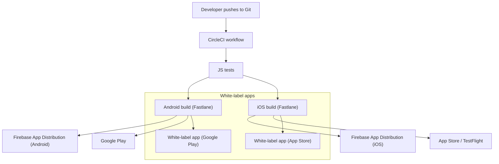
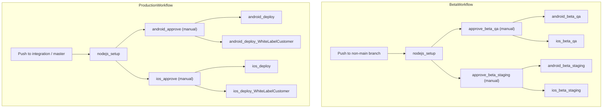
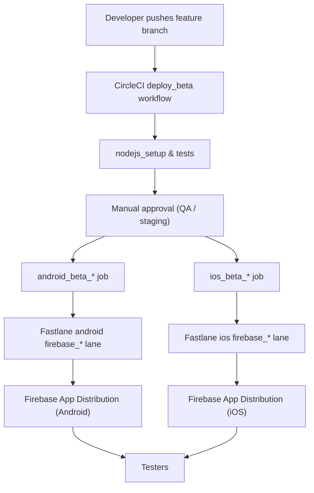
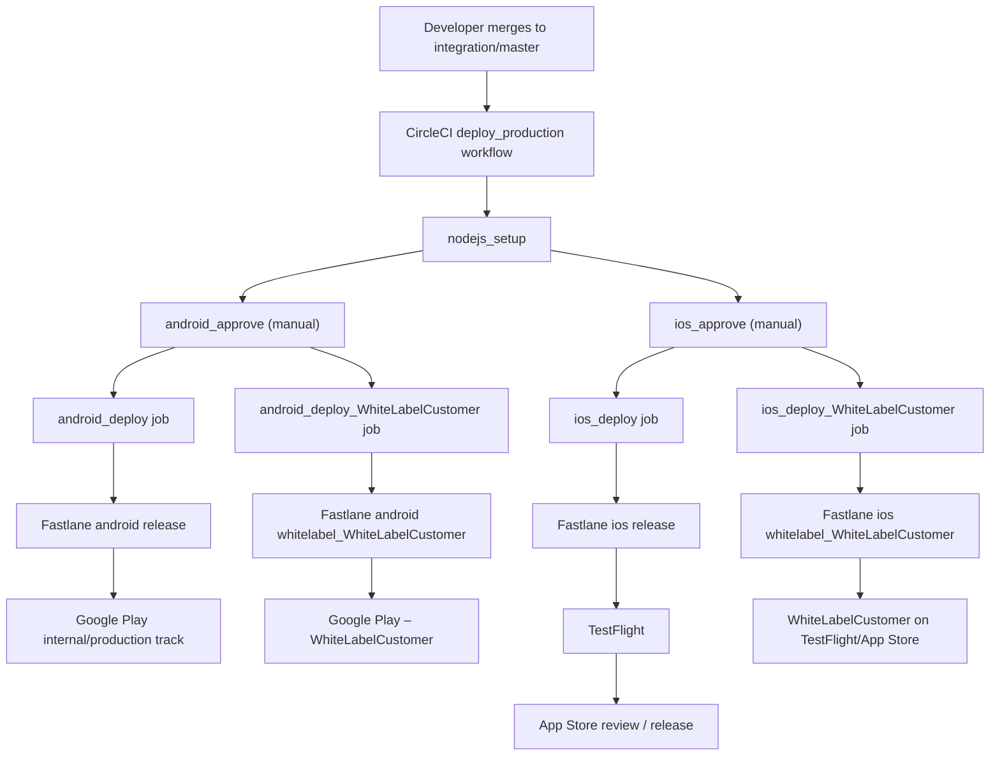
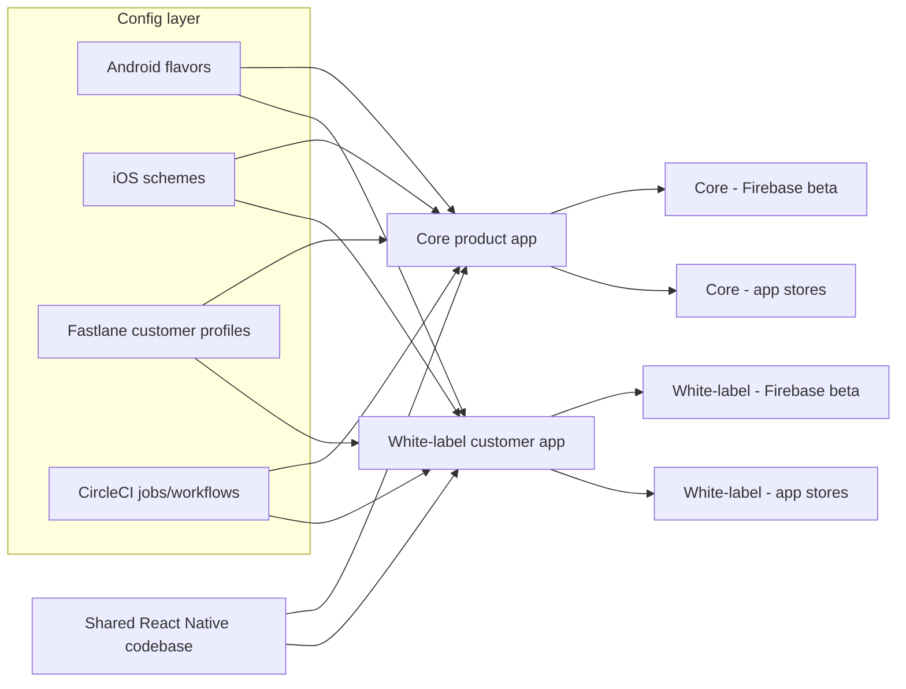

# Mobile CI/CD Examples for React Native (CircleCI + Fastlane)

This repository contains a trimmed-down, **production-style example** of a mobile CI/CD setup for a React Native application.

It demonstrates:

- Continuous integration with **CircleCI**
- Automated mobile pipelines using **Fastlane**
- **Beta distribution** via **Firebase App Distribution**
- **Production distribution** to **Google Play** and **Apple App Store / TestFlight**
- A fully wired **white-labeling** flow for an additional customer application

> ℹ️ This repository was prepared as a demo for a conference talk.  
> Watch the recording here:  
> **[YouTube – Mobile CI/CD Examples](https://www.youtube.com/watch?v=qx92Lmo_g5E)**

---

## Table of Contents

1. [High-Level Architecture](#high-level-architecture)  
2. [Repository Structure](#repository-structure)  
3. [Environments & Flavors](#environments--flavors)  
4. [CI/CD Workflows in CircleCI](#cicd-workflows-in-circleci)  
5. [Fastlane Lanes](#fastlane-lanes)  
6. [Beta Distribution (Firebase)](#beta-distribution-firebase)  
7. [Production Distribution (App Store / Google Play)](#production-distribution-app-store--google-play)  
8. [White-Labeling Concept](#white-labeling-concept)  
9. [White-Labeling Implementation Details](#white-labeling-implementation-details)  
10. [Secrets & Environment Variables](#secrets--environment-variables)  
11. [Local Usage & Example Commands](#local-usage--example-commands)  
12. [Extending with a New White-Label Customer](#extending-with-a-new-white-label-customer)  
13. [Additional Resources](#additional-resources)

---

## High-Level Architecture

At a high level, this project shows how a single React Native codebase can be built and shipped to:

- Internal testers (Firebase App Distribution)
- Public app stores (Google Play + App Store / TestFlight)
- Multiple brands (white-label customers)



---

## Repository Structure

The most relevant directories and files:

| Path                              | Description                                                                 |
|-----------------------------------|-----------------------------------------------------------------------------|
| `./android/`                      | Android Gradle project (React Native app, flavors, signing).               |
| `./android/app/build.gradle`      | App module Gradle file with **productFlavors**, including white-label.     |
| `./android/keystores/`           | Android keystore storage + notes.                                          |
| `./ios/`                          | iOS project directory (Xcode project/workspace expected here).             |
| `./fastlane/Fastfile`            | Main Fastlane configuration for Android & iOS.                             |
| `./fastlane/Matchfile`           | Configuration for `fastlane match` (certificate provisioning).             |
| `./fastlane/helpers/CompanyFastlane.rb` | Ruby helper with **build profiles** (QA/Staging/Production/WhiteLabel). |
| `./fastlane/helpers/beta_msg.sh` | Script generating release notes for beta builds.                           |
| `./fastlane/helpers/apk_report.sh` | Script for APK inspection using `apkanalyzer`.                           |
| `./.circleci/config.yml`         | CircleCI pipelines and workflows for beta & production.                    |
| `./docs/README.md`               | Extra links to documentation.                                              |
| `./android/keystores/README.md`  | Notes on keystore generation and usage.                                    |

---

## Environments & Flavors

The project uses **multiple environments** and **flavors**:

### Android

Defined in `android/app/build.gradle` via `productFlavors`:

- `production`
- `qa`
- `staging`
- `WhiteLabelCustomer` (white-label example)

Each flavor has its own:

- `applicationId` (e.g. `com.company.CompanyProduct`, `com.WhiteLabelCustomer.Product`)
- `resValue "string", "app_name", ...` to change app name
- `signingConfig` (`release`, `release_branded`, etc.)

### iOS

On iOS the differentiation is driven by **Xcode schemes** and **bundle IDs**, as configured in `CompanyFastlane.rb`:

- `Product.qa`, `Product.staging`, `Product` (production)
- `WhiteLabelCustomer` scheme for the white-label build

Each iOS profile sets:

- `BUNDLEID`  
- `XCODESCHEME`  
- `GOOGLESERVICEPLIST` (per-environment GoogleService-Info.plist)

---

## CI/CD Workflows in CircleCI

The CI is defined in `.circleci/config.yml`.

Key elements:

- **`nodejs_setup`** job  
  - Restores source cache  
  - Installs JS dependencies (`yarn`)  
  - Runs tests with JUnit reporting

- **Android jobs** (build, approve, deploy)  
  - Use anchors like `*android_flow_beta`, `*android_flow_deploy`  
  - Execute **Fastlane** via a shared `fastlane_execute` command

- **iOS jobs** (build, approve, deploy)  
  - Use anchors like `*ios_flow_beta`, `*ios_flow_deploy`  
  - Also drive Fastlane

- **Contexts** such as `mobile-ci-cd-qa`, `mobile-ci-cd-staging`, `mobile-ci-cd-production`  
  - Hold environment-specific secrets (Firebase tokens, keystores, Match password, etc.).

CircleCI workflows (simplified):



Each deploy job sets `FASTLANE_LANE` to the correct Fastlane lane:

- `android firebase_qa`, `android firebase_staging`, `android firebase_production`
- `android release`, `android whitelabel_WhiteLabelCustomer`
- `ios firebase_qa`, `ios firebase_staging`, `ios firebase_production`
- `ios release`, `ios whitelabel_WhiteLabelCustomer`

---

## Fastlane Lanes

### Shared configuration

`Gemfile` pins Fastlane:

```ruby
gem 'fastlane', '>=2.135.2'
```

`fastlane/Pluginfile` enables Firebase distribution:

```ruby
gem 'fastlane-plugin-firebase_app_distribution'
```

`fastlane/Matchfile` configures certificate storage in a Git repo:

```ruby
git_url('git@github.com:Company/fastlane_secrets.git')
git_branch('master')
storage_mode('git')
shallow_clone(true)
type('adhoc')
readonly(true)
username('engineering@example.com')
```

### Android lanes (in `fastlane/Fastfile`)

Main Android lanes (names parsed from the file):

- `firebase_qa`
- `firebase_staging`
- `firebase_production`
- `release`
- `whitelabel_WhiteLabelCustomer`

Common internal/private lanes:

- `common_build` – orchestrates the build for a given “customer profile”
- `distribution_firebase` – uploads to Firebase App Distribution
- `distribution_playmarket` – uploads to Google Play

The `before_all` hook:

```ruby
before_all do
  ensure_env_vars(env_vars: ['FIREBASE_CLI_TOKEN'])
  sh "./helpers/beta_msg.sh > helpers/beta_msg_placeholder.txt"
end
```

### iOS lanes (in `fastlane/Fastfile`)

Mirror the Android lanes:

- `firebase_qa`, `firebase_staging`, `firebase_production`
- `release`
- `whitelabel_WhiteLabelCustomer`
- `update_apple_certs` and `whitelabel_WhiteLabelCustomer_update_apple_certs`

Private lanes:

- `distribution_firebase` – beta via Firebase App Distribution
- `distribution_testflight` – upload to TestFlight
- `update_apple_certs` – wraps `match` for certificate/provisioning management

---

## Beta Distribution (Firebase)

Beta distribution is built on top of **Fastlane + Firebase App Distribution**.

### Flow



### Key pieces

- `CompanyFastlane::BuildsInternal::Qa` / `Staging` / `Production` define:
  - `ANDROIDGRADLETASK` (e.g. `clean assembleQaRelease`)
  - `BUNDLEID`
  - `GOOGLESERVICEPLIST`
  - `XCODESCHEME`
  - `FIREBASERELEASENOTESFILE` (shared across internal builds)
  - Firebase application IDs via env vars (e.g. `ANDROID_FIREBASE_APP_QA`)

- `beta_msg.sh` generates a release notes file with:
  - Git branch & build number
  - Project name
  - PR link
  - CircleCI build URL
  - Latest commit message

This file is used by the Firebase distribution lane for consistent, traceable release notes.

---

## Production Distribution (App Store / Google Play)

Production distribution uses dedicated **release** lanes and a separate **deploy_production** workflow in CircleCI.

### Flow



### Android production specifics

From `CompanyFastlane`:

- Common flags:
  - `PLAYMARKETTRACK = 'internal'` (internal track used as an example)
  - `PLAYMARKETSKIPUPLOADSCREENSHOTS = true`
  - `PLAYMARKETSKIPUPLOADMETADATA = false`
- For production build profile (e.g. `BuildsInternal::Production`):
  - `ANDROIDGRADLETASK  = 'clean assembleProductionRelease'`
  - `BUNDLEID           = 'com.company.CompanyProduct'`
- For white-label build profile (`BuildsWhiteLabel::WhiteLabelCustomer`):
  - `ANDROIDGRADLETASK  = 'clean assembleWhiteLabelCustomerRelease'`
  - `BUNDLEID           = 'com.WhiteLabelCustomer.Product'`

### iOS production specifics

- Uses `gym` with export methods configured via `GYMEXPORTMETHOD`
  - Internal builds: `ad-hoc`
  - White-label builds: `app-store`
- Uses `match` with:
  - `MATCHTYPE` set to `adhoc` or `appstore`
  - Custom `MATCHGITBRANCH` (`WhiteLabelCustomer` for the white-label app)
- Lanes like `update_apple_certs` and `whitelabel_WhiteLabelCustomer_update_apple_certs` manage provisioning profiles for each profile separately.

---

## White-Labeling Concept

**White-labeling** in this repository means:

> Single React Native codebase → multiple branded apps (with different bundle IDs, app names, certificates, and distribution targets), all managed via one CI/CD pipeline.

Goals of the white-label design here:

- Reuse **100% of business logic and UI code**
- Isolate branding and distribution logic in:
  - Android `productFlavors`
  - iOS schemes & bundle IDs
  - Fastlane configuration (`CompanyFastlane`, dedicated lanes)
  - CircleCI jobs and contexts
- Avoid copying projects or pipelines per customer

Conceptually:



---

## White-Labeling Implementation Details

### 1. Android: `productFlavors`

In `android/app/build.gradle`:

```groovy
android {
    // ...

    productFlavors {
        production {
            dimension "version"
            signingConfig signingConfigs.release
            resValue "string", "app_name", "Product"
        }

        qa {
            dimension "version"
            signingConfig signingConfigs.release
            applicationIdSuffix ".qa"
            resValue "string", "app_name", "Product.qa"
        }

        // White-label example
        WhiteLabelCustomer {
            dimension "version"
            signingConfig signingConfigs.release_branded
            applicationId "com.WhiteLabelCustomer.Product"
            resValue "string", "app_name", "WhiteLabelCustomer XX"
        }
    }
}
```

**What changes per flavor:**

- `applicationId` (and optionally `applicationIdSuffix`)
- `app_name` resource
- `signingConfig` (different keystore for white-label customer)
- Potentially other resources (icons, colors, etc. — not included in this minimal example)

### 2. iOS: Schemes and bundle IDs

Defined indirectly via `CompanyFastlane.rb`:

```ruby
class CompanyFastlane
  XCODEPROJECT   = 'ios/Product.xcodeproj'
  XCODEWORKSPACE = 'ios/Product.xcworkspace'

  class BuildsInternal < CompanyFastlane
    class Qa < BuildsInternal
      BUNDLEID           = 'com.company.CompanyProduct.qa'
      GOOGLESERVICEPLIST = 'GoogleService.qa-Info.plist'
      XCODESCHEME        = 'Product.qa'
      # ...
    end

    class Production < BuildsInternal
      BUNDLEID           = 'com.company.CompanyProduct'
      GOOGLESERVICEPLIST = 'GoogleService.release-Info.plist'
      XCODESCHEME        = 'Product'
      # ...
    end
  end

  class BuildsWhiteLabel < CompanyFastlane
    GYMEXPORTMETHOD = 'app-store'
    MATCHTYPE       = 'appstore'
    SHOWDEVMENU     = 'false'

    class WhiteLabelCustomer < BuildsWhiteLabel
      ANDROIDGRADLETASK  = 'clean assembleWhiteLabelCustomerRelease'
      APPLEDEVPORTALTEAM = 'JHKJHKJHKJHK'
      BACKAPPNAME        = 'xxxsdfsdfsdfsd'
      BUNDLEID           = 'com.WhiteLabelCustomer.Product'
      GOOGLESERVICEPLIST = 'GoogleService.WhiteLabelCustomer-Info.plist'
      MATCHGITBRANCH     = 'WhiteLabelCustomer'
      TESTFLIGHTTEAM     = 'WhiteLabelCustomer  LLC'
      XCODESCHEME        = 'WhiteLabelCustomer'
      # ...
    end
  end
end
```

**Key idea:**  
Each white-label customer becomes a small Ruby class with all identifiers and build parameters centralized in one place.

### 3. Fastlane lanes per customer

The Fastlane lanes accept a “customer profile” and read attributes from the corresponding class (`CompanyFastlane::BuildsWhiteLabel::WhiteLabelCustomer`).

Examples (conceptual):

```ruby
lane :whitelabel_WhiteLabelCustomer do
  common_build(
    customer: CompanyFastlane::BuildsWhiteLabel::WhiteLabelCustomer
  )
  distribution_playmarket(
    customer: CompanyFastlane::BuildsWhiteLabel::WhiteLabelCustomer
  )
end

lane :whitelabel_WhiteLabelCustomer_update_apple_certs do
  update_apple_certs(
    customer: CompanyFastlane::BuildsWhiteLabel::WhiteLabelCustomer
  )
end
```

This keeps the pipeline **generic** (the same lanes), while **customer-specific** parameters live inside the Ruby helper classes.

### 4. CircleCI jobs per customer

`.circleci/config.yml` wires dedicated jobs for the white-label customer:

```yaml
android_deploy_WhiteLabelCustomer:
  <<: *android_flow_deploy
  environment:
    - FASTLANE_LANE: "android whitelabel_WhiteLabelCustomer"

ios_deploy_WhiteLabelCustomer:
  <<: *ios_flow_deploy
  environment:
    - FASTLANE_LANE: "ios whitelabel_WhiteLabelCustomer"
```

These jobs are then placed into production workflows with their own approvals:

```yaml
- ios_approve_WhiteLabelCustomer:
    type: approval
    <<: *workflow_deploy_filters

- android_approve_WhiteLabelCustomer:
    type: approval
    <<: *workflow_deploy_filters
```

---

## Secrets & Environment Variables

Secrets are injected via CircleCI **contexts** and Fastlane **environment variables**.

### Firebase and beta distribution

From `CompanyFastlane.rb`:

- `FIREBASE_CLI_TOKEN` – used by `fastlane-plugin-firebase_app_distribution`
- `ANDROID_FIREBASE_APP_QA`
- `ANDROID_FIREBASE_APP_STAGING`
- `ANDROID_FIREBASE_APP_PRODUCTION`

### iOS provisioning (Match)

From `CompanyFastlane.rb`:

- `sigh_com.company.CompanyProduct.qa_adhoc_profile-path`  
- `sigh_com.company.CompanyProduct.staging_adhoc_profile-path`  
- `sigh_com.company.CompanyProduct_adhoc_profile-path`  
- `sigh_com.company.CompanyProduct_appstore_profile-path`  
- `sigh_com.WhiteLabelCustomer.Product_appstore_profile-path`

These variables are generated by `fastlane match` and accessed in Ruby helpers.

### Android keystores

From `.circleci/config.yml`:

- `ANDROID_RELEASE_KEYSTORE` (base64-encoded keystore content)  
  - Decoded into `android/keystores/release.jks` during the build.

See `android/keystores/README.md` for keystore generation examples and notes.

---

## Local Usage & Example Commands

> ⚠️ The repo is a **partial example**, not a fully runnable production project.  
> Paths, bundle IDs, teams and package names are placeholders.

### Prerequisites

- Node.js + Yarn
- Android SDK / Java JDK
- Xcode (for iOS)
- Ruby + Bundler
- Firebase CLI

### Install dependencies

```bash
# Ruby gems
bundle install

# JavaScript dependencies
yarn install
```

### Run Fastlane lanes locally

Android QA beta:

```bash
bundle exec fastlane android firebase_qa
```

Android production release:

```bash
bundle exec fastlane android release
```

Android white-label release:

```bash
bundle exec fastlane android whitelabel_WhiteLabelCustomer
```

iOS QA beta:

```bash
bundle exec fastlane ios firebase_qa
```

iOS production release:

```bash
bundle exec fastlane ios release
```

iOS white-label release:

```bash
bundle exec fastlane ios whitelabel_WhiteLabelCustomer
```

Update Apple certificates for the white-label customer:

```bash
bundle exec fastlane ios whitelabel_WhiteLabelCustomer_update_apple_certs
```

Inspect Android APK outputs:

```bash
./fastlane/helpers/apk_report.sh
```

---

## Extending with a New White-Label Customer

To add another white-label customer:

1. **Android**
   - Add a new flavor in `android/app/build.gradle`:
     - Unique `applicationId`
     - App name via `resValue`
     - Dedicated `signingConfig` with its own keystore
   - Configure any brand-specific resources (icons, colors, etc.).

2. **iOS**
   - Add a new Xcode scheme.
   - Configure a new bundle ID in the project.
   - Add a dedicated `GoogleService.<Customer>-Info.plist` if using Firebase.

3. **Fastlane**
   - In `CompanyFastlane.rb`, create a new class under `BuildsWhiteLabel`:
     - Set `BUNDLEID`, `XCODESCHEME`, `GOOGLESERVICEPLIST`, `MATCHGITBRANCH`, etc.
   - Optionally add new Fastlane lanes mirroring `whitelabel_WhiteLabelCustomer`.

4. **CircleCI**
   - Add new jobs that point to the new Fastlane lanes (`FASTLANE_LANE` env).
   - Wire these jobs into the production workflow with appropriate approvals.
   - Add a new CircleCI context for the customer if you need separate secrets.

This approach keeps the pipeline template stable and lets you plug in new customers with minimal duplication.

---

## Additional Resources

- **Talk Recording**:  
  [YouTube – Mobile CI/CD Examples](https://www.youtube.com/watch?v=qx92Lmo_g5E)
- **Firebase Documentation** (see also `docs/README.md`)  
  General: <https://firebase.google.com/docs>  
- **Fastlane**: <https://fastlane.tools>  
- **CircleCI Config Reference**: <https://circleci.com/docs/configuration-reference/>

---

This README is intentionally detailed so it can be used as a reference during or after a CI/CD talk, and as a starting point for implementing similar pipelines in real projects.
